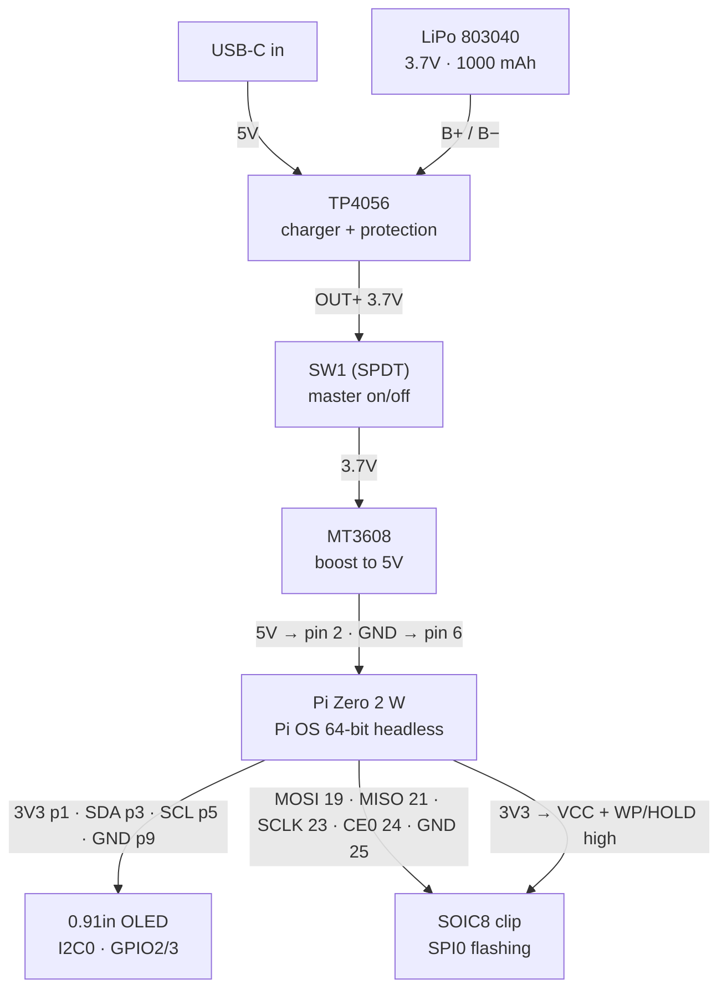

```mermaid
flowchart TB
    USB["USB-C in"] -- "5V" --> TP["TP4056<br/>charger + protection"]
    BAT["LiPo 803040<br/>3.7V · 1000 mAh"] -- "B+ / B−" --> TP
    TP -- "OUT+ 3.7V" --> SW["SW1 (SPDT)<br/>master on/off"]
    SW -- "3.7V" --> MT["MT3608<br/>boost to 5V"]
    MT -- "5V → pin 2 · GND → pin 6" --> PI["Pi Zero 2 W<br/>Pi OS 64-bit headless"]
    PI -- "3V3 p1 · SDA p3 · SCL p5 · GND p9" --> OLED["0.91in OLED<br/>I2C0 · GPIO2/3"]
    PI -- "MOSI 19 · MISO 21 · SCLK 23 · CE0 24 · GND 25" --> SOIC["SOIC8 clip<br/>SPI0 flashing"]
    PI -- "3V3 → VCC + WP/HOLD high" --> SOIC
```
